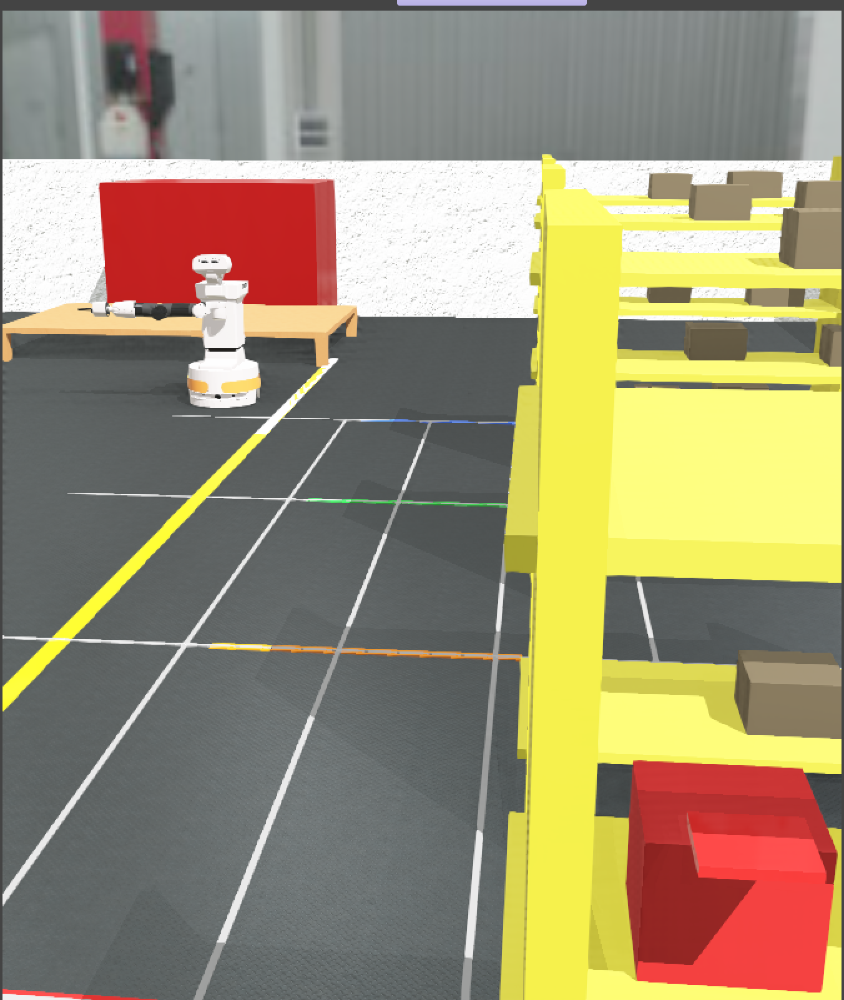
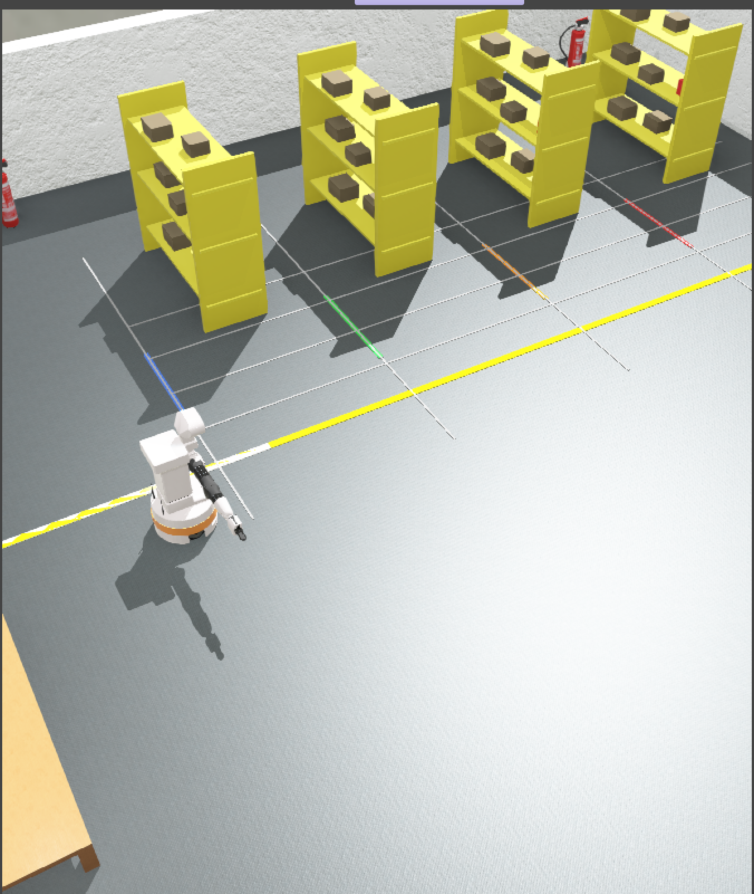

# FireBot — Autonomous Emergency Response Robot System

Multi-robot Webots R2025a simulation that retrieves firefighting equipment on demand. A LangGraph supervisor coordinates TIAGo / youBot agents; Moondream VLM (via Ollama) performs real camera vision; an Ollama LLM reasons about tasks. No mocks in the production path.

```
Emergency dispatch          VLM shelf scan                Autonomous delivery
 [LLM (Ollama)]       [Moondream via Ollama]          [LangGraph orchestration]
        │                        │                              │
   ┌────▼────┐            ┌──────▼──────┐                ┌──────▼──────┐
   │Supervisor│──cmds────▶│  TIAGo/youBot│──status──────▶│ MultiRobot  │
   │(LangGraph)│◀─GPS─────│  controllers │◀─VLM results──│ StateGraph  │
   └──────────┘            └─────────────┘                └────────────┘
```
## 🔥 System Preview

<p align="center">
  
</p>

<p align="center">
  
  
</p>

---

## World Layout (`worlds/firestation_multi.wbt`)

| Component          | Pose / Size           | Notes                                  |
|--------------------|-----------------------|----------------------------------------|
| Floor              | 20m x 14m             | Concrete, colored navigation lines     |
| Racks A–D          | x = -3.35; y=5.5/3.5/1.5/-0.5 | Shelves with equipment boxes          |
| Equipment boxes    | On rack shelves       | `ext_co2`, `hazmat_suit`, `first_aid`, `scba_tank` |
| Truck platform     | (0, -4.5, 0.3)        | Drop table                             |
| TIAGo robot        | DEF `YOUBOT_ALPHA`    | PAL Robotics TIAGo controller          |
| Supervisor         | DEF `SUPERVISOR`      | LangGraph coordinator (extern)         |

### Navigation grid (visual floor guides)
```
             x=-3.8  x=-3.2  x=-2.6  x=-2.0  x=-1.5 (yellow spine)
                │       │       │       │       │
 y=4.5  ────────┼───────┼───────┼───────┼───────┤  Aisle A (red)
 y=2.5  ────────┼───────┼───────┼───────┼───────┤  Aisle B (orange)
 y=0.5  ────────┼───────┼───────┼───────┼───────┤  Aisle C (green)
 y=-1.5 ────────┼───────┼───────┼───────┼───────┤  Aisle D (blue)
                                       │
 y=-3.0                                ┤  Truck approach
 y=-4.0                                ┘  Truck drop
```

---

## Repository Structure (key parts)

```
firebot/
├── worlds/
│   ├── firestation.wbt          # Single-robot world (youBot)
│   └── firestation_multi.wbt    # Production multi-robot world (TIAGo)
├── controllers/
│   ├── firebot_supervisor/      # Webots Supervisor + LangGraph orchestration
│   │   ├── firebot_supervisor.py
│   │   └── multi_robot_graph.py
│   ├── youbot_alpha/            # Robot controller: VLM scan, line follow, pick/deliver
│   ├── youbot_beta/             # Same as alpha with ROBOT_ID="beta"
│   └── youbot_loader/           # Single-robot controller (v9) + Gemini optional vision
├── perception/
│   ├── vlm_moondream.py         # Moondream VLM via Ollama (real vision)
│   └── vision_module.py         # Camera wrapper + VLM integration
├── world_model/
│   └── shared_state.py          # WorldState TypedDict + enums + helpers
├── config/
│   ├── settings.py              # Waypoints, arm presets, aisles, VLM config
│   └── requirements.txt         # Python deps
└── supervisor.log               # Runtime log (created at run time)
```

---

## How It Works

### 1) Supervisor (`controllers/firebot_supervisor/firebot_supervisor.py`)
- Webots `Supervisor` node; starts LangGraph `MultiRobotGraph`.
- After 2s chooses an emergency type and calls `graph.receive_emergency()`.
- Each tick: reads robot pose, updates graph state, moves carried boxes, sends `cmd_vel` to ROS2 bridge (UDP 9909), drives state machine `idle → navigating_to_shelf → picking → navigating_to_drop → dropping → idle`.
- Logs events and LLM reasoning to `supervisor.log`.

### 2) LangGraph Coordinator (`multi_robot_graph.py`)
- Real `langgraph.graph.StateGraph` with nodes: `dispatch → monitor → allocate → coordinate → END`.
- LLM (Ollama) used in `dispatch`, `monitor`, `allocate` with strict Pydantic JSON schemas; `coordinate` is deterministic for safety.
- State includes mission phase, task queue, robot poses/states, VLM detections, collision alerts, replan flags, and LLM logs.

### 3) Robot Controllers (`controllers/youbot_alpha|beta`)
- Vision: Moondream VLM on live camera frames (base64 JPEG) — no mocks.
- Navigation: line following on colored floor lines + PID waypoint `goto()` / `turn_to()`.
- Pick: approach spine → face shelf → READY → VLM micro-adjust scans (4 offsets) → GRAB/LIFT → retreat.
- Deliver: navigate to truck approach/drop, open gripper, report.
- Obstacle checks via VLM; GPS fused with odom when available.

### 4) Single-Robot Variant (`youbot_loader.py`, v9)
- For `firestation.wbt`; optional Gemini 2.0 Flash via `vision_api.py`.
- Adds obstacle detection from bottom-of-frame darkness, sensor fusion, obstacle recovery, and VLM-based lateral offsets.

---

## Prerequisites

| Dependency | Version | Purpose |
|------------|---------|---------|
| Webots | R2025a | Simulation |
| Ollama | latest | Local LLM/VLM runtime |
| Python | 3.10+ | Controllers |
| langgraph | ≥0.1.0 | Agentic state machine |
| pydantic | ≥2.0 | LLM output validation |
| numpy, opencv-python, requests | — | Vision + HTTP |

---

## Setup

1) Install Ollama and pull models
```bash
curl -fsSL https://ollama.ai/install.sh | sh
ollama pull moondream          # VLM
ollama pull llama3.2:3b        # LLM for planning
```

2) Python deps
```bash
pip install -r config/requirements.txt
# or minimal:
pip install langgraph pydantic numpy opencv-python requests
```

3) Environment
```bash
ollama serve &
export OLLAMA_LLM_MODEL="llama3.2:3b"         # override if desired
export OLLAMA_URL="http://localhost:11434"
export GEMINI_API_KEY="..."                   # only if using vision_api.py
```

---

## Running

### Multi-robot (TIAGo + supervisor)
1. Open Webots R2025a and load `worlds/firestation_multi.wbt`.
2. Run the simulation (play).
3. Start TIAGo controller externally if needed; supervisor starts automatically.
4. Monitor `supervisor.log` for dispatch, picks, deliveries, and LLM reasoning.

### Single-robot demo (youBot)
1. Open `worlds/firestation.wbt`.
2. In another shell:
```bash
cd controllers/youbot_loader
python youbot_loader.py
```

---

## Emergency Types

| Emergency          | Priority Order                                  | Aisle hint |
|--------------------|--------------------------------------------------|------------|
| electrical_fire    | CO2 extinguisher → SCBA tank → first aid → hazmat | A, D, C, B |
| chemical_spill     | Hazmat → SCBA → first aid → CO2                   | B, D, C, A |
| structure_fire     | SCBA → first aid → CO2 → hazmat                  | D, C, A, B |
| wildfire           | SCBA → hazmat → first aid → CO2                  | D, B, C, A |

---

## Configuration (`config/settings.py`)

| Key                        | Default | Notes |
|----------------------------|---------|-------|
| `TIMESTEP`                 | 32 ms   | Webots step |
| `SPINE_X`                  | -1.5    | Corridor x |
| `SHELF_X`                  | -2.0    | Shelf approach x |
| `GPS_BROADCAST_INTERVAL`   | 0.05 s  | Supervisor → robots |
| `VLM_SCAN_INTERVAL`        | 2.0 s   | Min gap between VLM calls |
| `ARM_PRESETS`              | dict    | HOME / READY / GRAB / LIFT / DROP joint angles |

---

## Logs

- Runtime: `/home/aastha/firebot/supervisor.log` (navigation, dispatch, picks, deliveries, LLM calls).
- LLM decisions also stored in `graph.state["llm_reasoning_log"]` with latency.

---

## Version History

| Version | Highlights |
|---------|------------|
| v1–v7   | Hardcoded waypoints, mock vision, no LLM |
| v8      | PID nav, waypoint grid, basic camera init |
| v9      | Moondream+Gemini vision, obstacle detection, line following, GPS fusion, LangGraph with Ollama, strict Pydantic JSON, no mocks |
